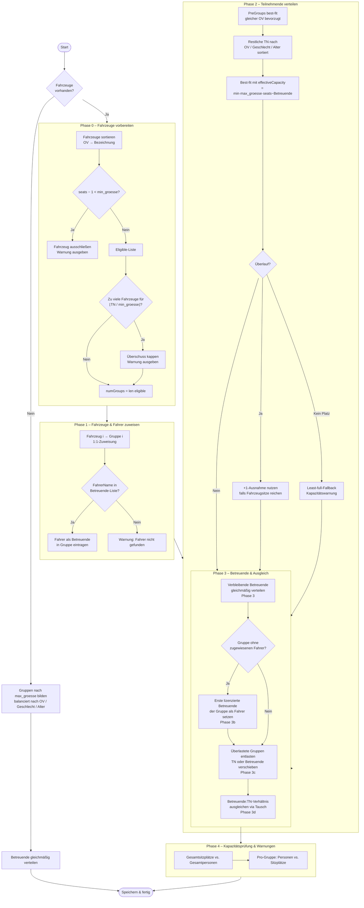

# Jugendolympiade Verwaltung

A desktop application for managing youth Olympics events. Built with [Wails v2](https://wails.io/) (Go backend + Web frontend), this application handles participant registration, group distribution, station scoring, evaluations, and certificate generation.

## Features

### 🏆 Participant Management
- **Excel Import**: Import participant, supervisor, and vehicle data from XLSX files with automatic validation
- **Smart Groups**: Vehicle-first balanced group distribution — one group per vehicle, respecting seat capacity, minimum group size, and Betreuende:Teilnehmende ratio
- **Database Storage**: All data stored in a local SQLite database
- **Configuration**: Adjustable event settings via `config.toml` (group size limits, score bounds, event name)

### 🎯 Station Scoring
- **Track Performance**: Record scores for each group at different stations
- **Import Stations**: Station names are loaded automatically from the Excel file
- **Real-time Updates**: Scores are saved immediately

### 📊 Evaluations
- **Group Rankings**: View rankings by group with total scores
- **Ortsverband Rankings**: Compare districts by average scores
- **Statistics**: Participant counts, score distributions, and averages

### 📄 PDF Generation
All PDFs are automatically saved to the configured output directory (default: `pdfdocs/`):
- **Groups Report**: One page per group with participant lists, vehicle, and Betreuende
- **Station Sheets** (`Stationslaufzettel`): One sheet per group for on-site score recording
- **Group Evaluations**: Rankings by group with scores
- **Ortsverband Evaluations**: Rankings by district
- **Participant Certificates**: Individual certificates for all participants
  - Supports custom certificate templates (`templates/background_urkunde_teilnehmende.png`)
  - Shows participant details, group assignment, and ranking
  - **Style `text`** (default): lists all group members as a table
  - **Style `picture`**: embeds a group photo (`pictures/group_picture_XXX.jpg`)
  - Style controlled via `urkunden_stil` in `config.toml`
- **Ortsverband Certificates**: One certificate per Ortsverband
  - Best Ortsverband(e) (all tied on highest average score) get a special Siegerurkunde with `ov_winner_image.png`
  - All others get an identical participation certificate (no ranking)
  - Optional background template: `templates/background_urkunde_ovs.png`

### 🖥️ Desktop Application
- **Native Windows app** via Wails + WebView2
- **Modern GUI**: Clean, tabbed interface
- **Fast Performance**: Native Go backend with SQLite
- **Native File Dialogs**: OS-integrated file picker

## Installation

### Download
Download the latest release:
- **Windows**: `THW-JugendOlympiade.exe`

### First Launch
1. Double-click the executable to launch
2. Ensure [WebView2](https://developer.microsoft.com/microsoft-edge/webview2/) is installed (comes pre-installed on Windows 11)

## Usage

### 1. Load Participant Data

**Prepare Your Excel File:**

The XLSX file can contain up to four sheets — `Teilnehmende` is required, the rest are optional:

| Sheet | Required | Columns (in order) |
|---|---|---|
| **Teilnehmende** | ✅ | Name, Ortsverband, Alter, Geschlecht, PreGroup |
| **Betreuende** | optional | Name, Ortsverband, Fahrerlaubnis |
| **Fahrzeuge** | optional | Bezeichnung, Ortsverband, Funkrufname, FahrerName, Sitzplaetze |
| **Stationen** | optional | Name |

- First row of every sheet is treated as a header and skipped.
- `PreGroup`: if set, all participants sharing the same value are kept together in one group.
- `Fahrerlaubnis`: any value other than empty / `"/"` counts as a valid licence.
- `FahrerName`: name of the assigned driver (must match a row in the `Betreuende` sheet with `Fahrerlaubnis`).

**Import:**
1. Click **"Excel einlesen"** (in the 📝 Daten section)
2. Select your XLSX file
3. Wait for the confirmation message

### 2. Distribute into Groups

Click **"Gruppen zusammenstellen"** to run the distribution algorithm.

> **Note:** This step is intentionally separate so you can adjust `config.toml` before committing to a distribution. Once at least one score has been saved the button is locked to protect data integrity.

**How groups are formed** depends on whether vehicles are present:

#### Without vehicles
Participants are distributed into balanced groups of up to `max_groesse` people, balancing Ortsverband, Geschlecht, and Alter. Betreuende are then spread across groups.

#### With vehicles — vehicle-first algorithm
See [Group Distribution Algorithm](#group-distribution-algorithm) below for a full explanation.

### 3. View Groups

Click **"Gruppen anzeigen"** to see all created groups. Each group shows its participants, Betreuende, and assigned vehicle.

### 4. Add / View Stations

Station names are loaded automatically from the **Stationen** sheet of your Excel file. They appear in the score-entry view.

### 5. Enter Scores

1. Click **"Ergebniseingabe"** to open the results entry view
2. Select a group from the dropdown
3. Enter scores (configurable range, default 100–1200) for each station
4. Click **"Speichern"** per row or **"Alle Ergebnisse speichern"** to save all at once

### 6. View Evaluations

**Group Rankings:** Click **"Auswertung nach Gruppen"** — view total scores and rankings by group.

**Ortsverband Rankings:** Click **"Auswertung nach Ortsverband"** — view average scores per district.

### 7. Generate PDFs

| Button | Output file |
|---|---|
| Gruppen-PDF erstellen | `pdfdocs/Gruppeneinteilung.pdf` |
| Stationslaufzettel | `pdfdocs/Stationslaufzettel.pdf` |
| Auswertung Gruppen | `pdfdocs/Auswertung_nach_Gruppe.pdf` |
| Auswertung Ortsverbände | `pdfdocs/Auswertung_nach_Ortsverband.pdf` |
| Urkunden Teilnehmende | `pdfdocs/Urkunden_Teilnehmende.pdf` |
| Urkunden Ortsverbände | `pdfdocs/Urkunden_Ortsverbaende.pdf` |

---

## Group Distribution Algorithm

When vehicles are present the application uses a **vehicle-first algorithm** that guarantees every group fits in its assigned vehicle.

### Key concepts

| Term | Meaning |
|---|---|
| `max_groesse` | Hard cap on Teilnehmende per group (config) |
| `min_groesse` | Minimum TN per group; vehicles with fewer passenger seats are excluded (config, default 6) |
| `effectiveCapacity` | `min(max_groesse, vehicle_seats − betreuende_count)` — actual TN slots available in a group |
| `+1 exception` | If vehicle has more seats than `max_groesse` the extra seats absorb overflow TN silently |
| Phase 3c | Moves TN (or non-driver Betreuende) from a group where headcount exceeds seats to the group with the most spare seats |
| Phase 3d | Swaps a non-driver Betreuende ↔ TN between the highest and lowest Betreuende:TN-ratio groups, keeping headcount per group constant |

---

## Configuration (`config.toml`)

| Key | Default | Description |
|---|---|---|
| `[gruppen] max_groesse` | `8` | Maximum Teilnehmende per group |
| `[gruppen] min_groesse` | `6` | Minimum Teilnehmende per group (vehicle-first path) |
| `[gruppen] gruppennamen` | `[]` | Optional override names for groups |
| `[ergebnisse] min_punkte` | `100` | Minimum score per station |
| `[ergebnisse] max_punkte` | `1200` | Maximum score per station |
| `[veranstaltung] name` | `"Jugendolympiade"` | Event name shown in PDFs |
| `[veranstaltung] jahr` | `0` | Year shown in PDFs (0 = current year) |
| `[veranstaltung] ausgabe_verzeichnis` | `"pdfdocs"` | Output directory for generated PDFs |
| `urkunden_stil` | `"text"` | Certificate style: `text` or `picture` |

---

## Certificate Templates

Create professional-looking certificates with custom designs:

1. Design your certificate in A4 size (210mm × 297mm)
2. Save as PNG at 300 DPI (2480×3508 px)
3. Place it at `templates/background_urkunde_teilnehmende.png`

Leave space for dynamic content between x-coordinates 23px (5mm) and 680px (148mm). The application overlays participant name, Ortsverband, group number, ranking, and group member list automatically.

See [documentation/CERTIFICATE_TEMPLATE_README.md](documentation/CERTIFICATE_TEMPLATE_README.md) for detailed guidelines.

---

## Output Files

### Database
- **data.db** — SQLite database (participant data, group assignments, station scores)

### PDFs (default: `pdfdocs/`)
| File | Content |
|---|---|
| `Gruppeneinteilung.pdf` | Complete group listings with vehicle and Betreuende |
| `Stationslaufzettel.pdf` | Per-group station score sheets |
| `Auswertung_nach_Gruppe.pdf` | Group rankings by total score |
| `Auswertung_nach_Ortsverband.pdf` | District rankings by average score |
| `Urkunden_Teilnehmende.pdf` | Individual participant certificates |
| `Urkunden_Ortsverbaende.pdf` | Per-district certificates (winner gets Siegerurkunde) |

---

## Troubleshooting

**"failed to initialize database"**
- Ensure write permissions in the application directory
- Close any program that might be accessing `data.db`

**"invalid file format"**
- Check that your Excel file has a sheet named `Teilnehmende`
- Verify column order: Name, Ortsverband, Alter, Geschlecht, PreGroup
- Ensure the file is `.xlsx` format (not `.xls` or `.csv`)

**"age must be between 1 and 100"**
- Check for invalid values in the `Alter` column
- Remove empty rows or non-numeric values

**PDFs not generating**
- Ensure `pdfdocs/` directory can be created
- Close any open PDF files
- Check available disk space

**Application won't start**
- Install [Microsoft Edge WebView2](https://developer.microsoft.com/microsoft-edge/webview2/)
- If still failing, try running as administrator

---

## System Requirements

- **Windows 10 / 11** with WebView2
- **Disk**: ~50 MB for application + space for database and PDFs
- **Memory**: 256 MB minimum

---

## License

[Add your license here]

## Credits

Built with:
- [Wails](https://wails.io/) — Desktop application framework
- [Go](https://golang.org/) — Backend language
- [excelize](https://github.com/qax-os/excelize) — Excel processing
- [gofpdf](https://github.com/go-pdf/fpdf) — PDF generation

---

**For Developers**: See [documentation/README_DEVELOPER.md](documentation/README_DEVELOPER.md) for technical documentation, architecture details, and contribution guidelines.

## Features

### 🏆 Participant Management
- **Excel Import**: Import participant data from XLSX files with automatic validation
- **Smart Groups**: Automatically creates balanced groups based on configurable maximum group size
- **Database Storage**: All data stored securely in SQLite database
- **Configuration**: Adjustable event settings via `config.toml` (group size, score bounds, event name)

### ��� Station Scoring
- **Track Performance**: Record scores for each group at different stations
- **Import Stations**: Load station data from Excel files
- **Real-time Updates**: Scores are saved automatically

### ��� Evaluations
- **Group Rankings**: View rankings by group with total scores
- **Ortsverband Rankings**: Compare locations/districts by average scores
- **Statistics**: Participant counts, score distributions, and averages

### 📄 PDF Generation
All PDFs are automatically saved to the configured output directory (default: `pdfdocs/`):
- **Groups Report**: One page per group with participant lists and statistics
- **Group Evaluations**: Rankings by group with scores
- **Ortsverband Evaluations**: Rankings by location
- **Participant Certificates**: Individual certificates for all participants
  - Supports custom certificate templates (`templates/background_urkunde_teilnehmende.png`)
  - Shows participant details, group assignment, and ranking
  - **Style `text`** (default): lists all group members as a table
  - **Style `picture`**: embeds a group photo (`pictures/group_picture_XXX.jpg`)
  - Style controlled via `urkunden_stil` in `config.toml`
- **Ortsverband Certificates**: One certificate per Ortsverband
  - Best Ortsverband(e) (all tied on highest average score) get a special Siegerurkunde with `ov_winner_image.png`
  - All others get an identical participation certificate (no ranking)
  - Optional background template: `templates/background_urkunde_ovs.png`

### ���️ Desktop Application
- **Cross-Platform**: Runs on Windows, macOS, and Linux
- **Modern GUI**: Clean, intuitive interface
- **Fast Performance**: Native Go backend
- **Native File Dialogs**: OS-integrated file picker

## Installation

### Download
Download the latest release for your platform:
- **Windows**: \`THW-JugendOlympiade.exe\`
- **macOS**: \`THW-JugendOlympiade.app\`
- **Linux**: \`THW-JugendOlympiade\`

### First Launch
1. Double-click the executable to launch
2. On Windows, ensure [WebView2](https://developer.microsoft.com/microsoft-edge/webview2/) is installed
3. On macOS, you may need to allow the app in System Preferences → Security & Privacy

## Usage

### 1. Load Participant Data

**Prepare Your Excel File:**
- Create an XLSX file with a sheet named "Teilnehmende"
- You can start from `example/example_data.xlsx` (auto-extracted on first launch)
- Required columns (in order):
  1. **Name**: Participant name
  2. **Ortsverband**: Location/district
  3. **Alter**: Age (must be between 1-100)
  4. **Geschlecht**: Gender
- First row is treated as header and skipped

**Import:**
1. Click **"Excel einlesen"** (in the 📝 Daten section)
2. Select your XLSX file
3. Wait for confirmation message
4. Click "Gruppen zusammenstellen" to create balanced groups

### 2. Distribute into Groups

- Click "Gruppen zusammenstellen" to create balanced groups from the loaded data
- This step is intentionally separate so you can adjust settings in `config.toml` before committing to a distribution
- Once at least one score has been saved, this button is locked to protect data integrity

### 3. View Groups

- Click "Gruppen anzeigen" to view all created groups
- Groups are automatically balanced by:
  - Location (Ortsverband)
  - Age (Alter)
  - Gender (Geschlecht)
- Maximum participants per group is configurable (default: 8)

### 3. Add Stations

Station names are loaded automatically from the **second sheet** (`Stationen`) of your Excel file during import. If the sheet is present, all station names are stored in the database and will be available for score entry.

### 4. Enter Scores

1. Click "Ergebniseingabe" to open the results entry view
2. Select a group from the dropdown
3. Enter scores (configurable range, default 100–1200) for each station
4. Click "Speichern" per row or "Alle Ergebnisse speichern" to save all at once
5. Switch to the next group and repeat

### 5. View Evaluations

**Group Rankings:**
- Click "Auswertung nach Gruppen"
- View total scores and rankings by group

**Ortsverband Rankings:**
- Click "Auswertung nach Ortsverband"
- View average scores per location/district

### 6. Generate PDFs

**Group Reports:**
- Click "Gruppen-PDF erstellen"
- Generates detailed report in `pdfdocs/Gruppeneinteilung.pdf`

**Participant Certificates:**
- Click **"Urkunden Teilnehmende"**
- Generates one certificate per participant in `pdfdocs/Urkunden_Teilnehmende.pdf`
- Available only once at least one score has been saved

**Ortsverband Certificates:**
- Click **"Urkunden Ortsverbände"**
- Generates one page per Ortsverband in `pdfdocs/Urkunden_Ortsverbaende.pdf`
- The best-ranked Ortsverband receives a special Siegerurkunde with `ov_winner_image.png`; all others receive an identical participation certificate with no ranking
- Available only once at least one score has been saved

All PDFs are saved to the configured output directory (default: `pdfdocs/`).

## Certificate Templates

### Using Custom Templates

Create professional-looking certificates with custom designs:

1. **Create Template File:**
   - Design your certificate in A4 size (210mm × 297mm)
  - Save as `background_urkunde_teilnehmende.png`
  - Place in `templates/background_urkunde_teilnehmende.png`

2. **Template Specifications:**
   - **Size**: A4 (210mm × 297mm)
   - **Format**: PNG
   - **Resolution**: 2480×3508 pixels at 300 DPI
   - **Important**: Leave space for dynamic content between x-coordinates 23px (5mm) and 680px (147.83mm)

3. **Dynamic Content:**
   The following information is automatically overlaid on your template:
   - Participant name
   - Ortsverband (location)
   - Group number
   - Group ranking (1st, 2nd, 3rd place, etc.)
   - List of all group members

See [CERTIFICATE_TEMPLATE_README.md](CERTIFICATE_TEMPLATE_README.md) for detailed template guidelines.

## Output Files

After using the application, you'll find:

### Database
- **data.db**: SQLite database with all data
  - Participant information
  - Group assignments
  - Station scores
  - Evaluations

### PDFs (in configured output directory, default: pdfdocs/)
- **Gruppeneinteilung.pdf**: Complete group listings with statistics
- **Auswertung_nach_Gruppe.pdf**: Group rankings by total score
- **Auswertung_nach_Ortsverband.pdf**: Location rankings by average score
- **Urkunden_Teilnehmende.pdf**: Individual certificates for all participants
- **Urkunden_Ortsverbaende.pdf**: One certificate per Ortsverband (winner gets Siegerurkunde)

## Troubleshooting

### Common Issues

**"failed to initialize database"**
- Ensure you have write permissions in the application directory
- Close any other programs that might be accessing \`data.db\`

**"invalid file format"**
- Check that your Excel file has a sheet named "Teilnehmende"
- Verify column headers: Name, Ortsverband, Alter, Geschlecht
- Ensure file is \`.xlsx\` format (not \`.xls\` or \`.csv\`)

**"age must be between 1 and 100"**
- Check for invalid age values in your Excel file
- Ensure the Alter column contains only numbers
- Remove any empty rows or non-numeric values

**PDFs not generating**
- Ensure \`pdfdocs/\` directory can be created
- Close any PDF files that might be open
- Check available disk space

**Application won't start (Windows)**
- Install [Microsoft Edge WebView2](https://developer.microsoft.com/microsoft-edge/webview2/)
- If still failing, try running as administrator

**Application won't start (macOS)**
- Right-click the app → Open (first time only)
- Go to System Preferences → Security & Privacy → Allow the app

**Application won't start (Linux)**
- Make the file executable: `chmod +x THW-JugendOlympiade`
- Install required libraries: \`sudo apt-get install libgtk-3-0 libwebkit2gtk-4.0-37\`

### Getting Help

1. Check this README for solutions
2. Review error messages carefully
3. Verify your input data format
4. Try with a smaller test dataset first

## System Requirements

- **Windows**: Windows 10/11 with WebView2
- **macOS**: macOS 10.13 or later
- **Linux**: Modern distribution with GTK3 and WebKit2GTK

**Disk Space**: ~50MB for application, plus space for database and PDFs

**Memory**: 256MB minimum, 512MB recommended

## License

[Add your license here]

## Credits

Built with:
- [Wails](https://wails.io/) - Desktop application framework
- [Go](https://golang.org/) - Backend language
- [excelize](https://github.com/qax-os/excelize) - Excel processing
- [gofpdf](https://github.com/go-pdf/fpdf) - PDF generation

---

**For Developers**: See [README_DEVELOPER.md](README_DEVELOPER.md) for technical documentation, architecture details, and contribution guidelines.
