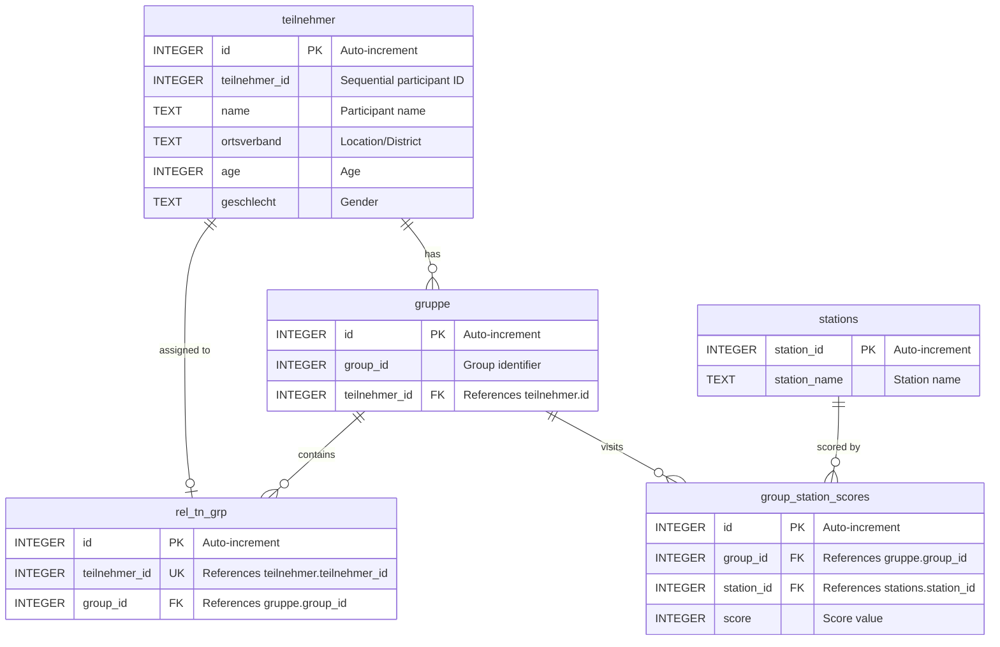

# Developer Documentation - Jugendolympiade Verwaltung

Technical documentation for developers working on the Jugendolympiade Verwaltung application.

**User Documentation**: See [README.md](README.md) for end-user instructions.


## Table of Contents

- [Development Requirements](#development-requirements)
- [Project Structure](#project-structure)
- [Architecture](#architecture)
- [Database Schema](#database-schema)
- [Algorithms](#algorithms)
- [Testing](#testing)
- [Security & Performance](#security--performance)
- [Development Setup](#development-setup)
- [Building](#building)
- [Configuration](#configuration)
- [Contributing](#contributing)

## Development Requirements

### Core Dependencies
- **Go**: 1.21 or later
- **Wails CLI**: v2.x (`go install github.com/wailsapp/wails/v2/cmd/wails@latest`)
- **GCC**: For CGO/SQLite compilation
  - Windows: [MinGW](https://www.mingw-w64.org/) or [TDM-GCC](https://jmeubank.github.io/tdm-gcc/)
  - macOS: Xcode Command Line Tools (`xcode-select --install`)
  - Linux: build-essential (`sudo apt-get install build-essential`)
- **Node.js**: Not required (frontend is vanilla JS)

### Go Modules
```bash
go mod download
```

Key dependencies automatically installed:
- `github.com/wailsapp/wails/v2` - Desktop framework
- `github.com/xuri/excelize/v2` - Excel processing
- `github.com/jung-kurt/gofpdf` - PDF generation
- `modernc.org/sqlite` - Pure Go SQLite driver

## Project Structure

```
experiment1/
├── backend/                  # Go backend code
│   ├── database/            # Database layer
│   │   ├── db.go           # DB initialization and connection
│   │   ├── queries.go      # Optimized read queries
│   │   ├── inserts.go      # Write operations
│   │   ├── evaluations.go  # Ranking and evaluation queries
│   │   └── scores.go       # Score management
│   ├── io/                 # Input/Output operations
│   │   ├── input.go        # Excel import with validation
│   │   └── output.go       # PDF generation
│   ├── models/             # Data models
│   │   └── types.go        # Structs and type definitions
│   └── services/           # Business logic
│       └── distribution.go # Group distribution algorithm
├── frontend/               # Web frontend (vanilla JS)
│   ├── index.html         # Main UI structure
│   ├── app.js             # Application logic & Wails bindings
│   └── styles.css         # Styling
├── build/                  # Build outputs
│   ├── bin/               # Compiled executables
│   ├── appicon.png        # Application icon (PNG)
│   └── windows/           
│       └── icon.ico       # Windows icon (ICO)
├── dev_utils/              # Development utilities
│   ├── convert_icon.ps1   # PowerShell icon converter
│   ├── convert_icon.py    # Python icon converter
│   └── README.md          # Utility documentation
├── pdfdocs/                # PDF outputs (auto-created at runtime)
├── test/                   # Unit and integration tests
│   ├── input_test.go      # Excel import validation tests
│   ├── distribution_test.go # Group distribution tests
│   └── README.md          # Test documentation
├── main.go                 # Application entry point & Wails setup
├── wails.json             # Wails build configuration
├── go.mod                 # Go module definition
├── go.sum                 # Go module checksums
├── README.md              # User documentation
└── README_DEVELOPER.md    # This file
```

### Backend Architecture

**Layered Architecture:**
1. **main.go**: Entry point, Wails bindings, high-level orchestration
2. **backend/database**: Data access layer (DAL)
3. **backend/services**: Business logic layer
4. **backend/io**: File I/O operations
5. **backend/models**: Shared data structures

**Key Design Patterns:**
- **Singleton DB Connection**: Global `currentDB` variable (consider refactoring)
- **Transaction Wrapping**: Bulk operations use transactions
- **Error Propagation**: Explicit error handling throughout

## Architecture

### Application Flow

```
User Interaction (Frontend)
    ↓
Wails Runtime Binding
    ↓
Go Backend Methods (main.go)
    ↓
Service Layer (business logic)
    ↓
Database Layer (queries, inserts)
    ↓
SQLite Database (data.db)
```

### Frontend ↔ Backend Communication

The frontend communicates with Go backend via Wails runtime:

```javascript
// Frontend (app.js)
const result = await window.go.main.App.LoadFile();
```

```go
// Backend (main.go)
func (a *App) LoadFile() map[string]interface{} {
    // Implementation
}
```

All public methods on `App` struct are automatically bound.

## Database Schema

The application uses SQLite with five main tables:

### Entity-Relationship Diagram



### Table Details

#### teilnehmer (Participants)
Primary participant data table.

```sql
CREATE TABLE teilnehmer (
    id INTEGER PRIMARY KEY AUTOINCREMENT,
    teilnehmer_id INTEGER,
    name TEXT,
    ortsverband TEXT,
    age INTEGER,
    geschlecht TEXT
);
```

- `id`: Internal auto-increment key
- `teilnehmer_id`: Sequential ID based on import order (1, 2, 3, ...)
- `name`, `ortsverband`, `age`, `geschlecht`: Data from Excel import

#### gruppe (Groups - Legacy)
Maintained for backward compatibility. Duplicates data in `rel_tn_grp`.

```sql
CREATE TABLE gruppe (
    id INTEGER PRIMARY KEY AUTOINCREMENT,
    group_id INTEGER,
    teilnehmer_id INTEGER,
    FOREIGN KEY (teilnehmer_id) REFERENCES teilnehmer(id)
);
```

**Known Issue**: Redundant with `rel_tn_grp`. Consider deprecating in future versions.

#### rel_tn_grp (Participant-Group Relationships)
Primary grouping table. Enforces one-group-per-participant constraint.

```sql
CREATE TABLE rel_tn_grp (
    id INTEGER PRIMARY KEY AUTOINCREMENT,
    teilnehmer_id INTEGER UNIQUE NOT NULL,
    group_id INTEGER NOT NULL,
    FOREIGN KEY (teilnehmer_id) REFERENCES teilnehmer(teilnehmer_id),
    FOREIGN KEY (group_id) REFERENCES gruppe(group_id)
);
```

- UNIQUE constraint on `teilnehmer_id` prevents double-assignment
- Used by distribution algorithm and queries

#### stations (Activity Stations)
List of stations/activities for scoring.

```sql
CREATE TABLE stations (
    station_id INTEGER PRIMARY KEY AUTOINCREMENT,
    station_name TEXT NOT NULL
);
```

#### group_station_scores (Performance Tracking)
Records group performance at each station.

```sql
CREATE TABLE group_station_scores (
    id INTEGER PRIMARY KEY AUTOINCREMENT,
    group_id INTEGER NOT NULL,
    station_id INTEGER NOT NULL,
    score INTEGER,
    FOREIGN KEY (group_id) REFERENCES gruppe(group_id),
    FOREIGN KEY (station_id) REFERENCES stations(station_id),
    UNIQUE(group_id, station_id)
);
```

- UNIQUE constraint prevents duplicate scores for same group-station combination
- Used for rankings and evaluations

## Algorithms

### Group Distribution Algorithm

**Location**: `backend/services/distribution.go`

**Objective**: Create balanced groups with maximum diversity across ortsverband, gender, and age.

**Algorithm Steps:**

1. **Calculate Group Count**
   ```go
   groupCount := (len(participants) + maxGroupSize - 1) / maxGroupSize
   ```
   - Divides participants into groups of ≤ 8 members
   - Ensures balanced group sizes

2. **Initialize Group Statistics**
   ```go
   type GroupStats struct {
       OrtsverbandCount map[string]int
       GeschlechtCount  map[string]int
       TotalAge         int
       MemberCount      int
   }
   ```
   - Tracks composition of each group for scoring

3. **Pre-Sort Participants**
   ```go
   sort.Slice(participants, func(i, j int) bool {
       if participants[i].Ortsverband != participants[j].Ortsverband {
           return participants[i].Ortsverband < participants[j].Ortsverband
       }
       // ... additional sorting
   })
   ```
   - Improves initial distribution quality
   - Ensures consistent output

4. **Diversity Scoring**
   For each participant, calculate score for each group:
   ```go
   score := 0.0
   score -= float64(stats.OrtsverbandCount[p.Ortsverband]) * 10.0  // Ortsverband penalty
   score -= float64(stats.GeschlechtCount[p.Geschlecht]) * 5.0     // Gender penalty
   score -= float64(abs(avgAge - p.Age)) * 2.0                      // Age difference penalty
   score -= float64(stats.MemberCount) * 3.0                         // Size penalty
   ```

5. **Greedy Assignment**
   - Assign each participant to highest-scoring group
   - Update group statistics after each assignment
   - O(n·g) complexity where n=participants, g=groups

**Time Complexity**: O(n·g) ≈ O(n²/8) for typical datasets

**Space Complexity**: O(g) for group statistics

### Evaluation Queries

**Group Evaluation** (`backend/database/evaluations.go`):
- Sums scores across all stations per group
- Orders by total score descending
- Uses single JOIN query (optimized)

**Ortsverband Evaluation**:
- Calculates average score per participant by ortsverband
- Original query had N+1 issue (fixed)
- Current: Single query with aggregation

## Testing

### Test Organization

Tests are located in `test/` directory :

```
test/
├── input_test.go           # Excel import validation (10 tests)
├── distribution_test.go    # Group distribution (8 tests)
└── README.md              # Detailed test documentation
```

### Running Tests

```bash
cd test
go test -v                  # Run all tests with verbose output
go test -run TestName       # Run specific test
go test -cover              # Run with coverage report
```

### Test Suites

#### Excel Import Tests (`input_test.go`)
Tests for `backend/io/input.go`:

1. `TestReadXLSXFile_ValidFile` - Valid file import
2. `TestReadXLSXFile_InvalidPath` - Non-existent file handling
3. `TestReadXLSXFile_InvalidHeaders` - Wrong column headers
4. `TestReadXLSXFile_MissingRequiredField` - Empty required fields
5. `TestReadXLSXFile_InvalidAge` - Age validation (1-100 range)
6. `TestReadXLSXFile_NonNumericAge` - Age type validation
7. `TestReadXLSXFile_EmptySheet` - Empty sheet handling
8. `TestValidateHeaders_Valid` - Header validation (positive)
9. `TestValidateHeaders_Invalid` - Header validation (negative)
10. `TestValidateParticipantRow` - Row validation logic

**Coverage**: ~85% of `input.go`

#### Distribution Tests (`distribution_test.go`)
Tests for `backend/services/distribution.go`:

1. `TestDistribution_BasicFunctionality` - Basic distribution works
2. `TestDistribution_EmptyParticipants` - Empty input handling
3. `TestDistribution_GroupSizeLimit` - Max 8 per group
4. `TestDistribution_SingleParticipant` - Edge case: 1 participant
5. `TestDistribution_ExactlyMaxSize` - Edge case: exactly 8 participants
6. `TestDistribution_StatisticsTracking` - Stats accuracy
7. `TestDistribution_DiversityScoring` - Diversity algorithm validation
8. `TestDistribution_ConsistentOutput` - Deterministic results

**Coverage**: ~90% of `distribution.go`

### Writing New Tests

**Test File Template:**
```go
package test

import (
    "testing"
    "experiment1/backend/services"
)

func TestNewFeature(t *testing.T) {
    // Arrange
    input := prepareTestData()
    
    // Act
    result := services.NewFeature(input)
    
    // Assert
    if result != expected {
        t.Errorf("Expected %v, got %v", expected, result)
    }
}
```

**Best Practices:**
- Use table-driven tests for multiple scenarios
- Mock database connections when possible
- Clean up test files/databases after tests
- Test both happy path and error cases

## Security & Performance

### Security Features

#### ✅ SQL Injection Protection
All database queries use parameterized statements:

```go
// ❌ VULNERABLE (old code)
query := fmt.Sprintf("SELECT * FROM teilnehmer WHERE id = %d", id)

// ✅ SAFE (current code)
query := "SELECT * FROM teilnehmer WHERE id = ?"
db.Query(query, id)
```

**Fixed in PR**: SQL injection vulnerabilities resolved in 5 locations.

#### ✅ Input Validation
Comprehensive validation in `backend/io/input.go`:

```go
func validateParticipantRow(row []string, rowIndex int) error {
    // Name validation
    if strings.TrimSpace(row[0]) == "" {
        return fmt.Errorf("row %d: name is required", rowIndex)
    }
    
    // Age validation
    age, err := strconv.Atoi(strings.TrimSpace(row[2]))
    if err != nil {
        return fmt.Errorf("row %d: age must be a number", rowIndex)
    }
    if age < 1 || age > 100 {
        return fmt.Errorf("row %d: age must be between 1 and 100", rowIndex)
    }
    
    // ... more validation
}
```

#### ✅ Type Safety
Strong typing throughout Go codebase prevents type confusion attacks.

#### ✅ Error Handling
Proper error propagation with context:

```go
if err != nil {
    return fmt.Errorf("failed to initialize database: %w", err)
}
```

### Performance Optimizations

#### ✅ N+1 Query Prevention

**Problem**: Original code made multiple queries in loops.

**Solution**: Use JOINs and map-based aggregation.

**Example - GetGroupsForReport():**

Before (N+1 pattern):
```go
// 1 query for groups
for _, group := range groups {
    // N queries for participants (32 queries for 32 groups)
    participants := getParticipantsForGroup(group.ID)
}
```

After (optimized):
```go
// 1 query with JOIN
rows := db.Query(`
    SELECT r.group_id, t.* 
    FROM rel_tn_grp r
    JOIN teilnehmer t ON r.teilnehmer_id = t.teilnehmer_id
    ORDER BY r.group_id
`)

// Map-based aggregation in memory
groupMap := make(map[int][]Participant)
for rows.Next() {
    // ... scan and aggregate
}
```

**Impact**: 32 queries → 2 queries (93% reduction)

#### ✅ Transaction Usage

Bulk inserts use transactions:

```go
tx, _ := db.Begin()
for _, participant := range participants {
    tx.Exec("INSERT INTO ...")
}
tx.Commit()
```

**Impact**: 10x faster for large datasets

#### ✅ Efficient Algorithms

- Group distribution: O(n·g) = O(n²/8) ≈ O(n) for fixed max group size
- Sorting preprocessing: O(n log n)
- Memory usage: O(g) for group statistics

#### ✅ Resource Management

- Proper cleanup with `defer db.Close()`
- File handles closed after use
- PDF streams flushed and closed

### Known Performance Issues

1. **Global DB Connection**: `currentDB` is a global variable
   - **Impact**: Not thread-safe, harder to test
   - **Fix**: Move to App struct or use connection pool

2. **Redundant Tables**: `gruppe` and `rel_tn_grp` duplicate data
   - **Impact**: Double writes, potential inconsistency
   - **Fix**: Deprecate `gruppe` table, migrate to `rel_tn_grp` only

3. **No Database Indexes**: Foreign keys lack indexes
   - **Impact**: Slower joins on large datasets
   - **Fix**: Add indexes on `group_id`, `teilnehmer_id`, `station_id`

## Development Setup

### 1. Install Prerequisites

**Go:**
```bash
# Download from https://go.dev/dl/
# Verify installation
go version  # Should show 1.21 or later
```

**Wails CLI:**
```bash
go install github.com/wailsapp/wails/v2/cmd/wails@latest
wails doctor  # Verify installation
```

**GCC (Windows):**
```bash
# Install MinGW or TDM-GCC
# Add to PATH
gcc --version  # Verify installation
```

### 2. Clone Repository

```bash
git clone <repository-url>
cd experiment1
go mod download
```

### 3. Development Mode

Launch with hot reload:

```bash
wails dev
```

This starts the app with:
- ✅ Frontend hot reload (HTML/CSS/JS changes)
- ✅ Backend recompilation on .go file changes
- ✅ DevTools enabled (F12)
- ✅ Console logging
- ✅ Faster startup (no packaging)

**Dev Mode Shortcuts:**
- `F5` - Reload frontend
- `F12` - Open DevTools
- `Ctrl+C` - Stop dev server

### 4. Make Changes

**Backend Changes:**
1. Edit Go files in `backend/` or `main.go`
2. Wails detects changes and recompiles
3. App restarts automatically

**Frontend Changes:**
1. Edit HTML/CSS/JS in `frontend/`
2. Browser reloads automatically
3. No restart needed

### 5. Test Changes

```bash
cd test
go test -v
```

Run specific test:
```bash
go test -v -run TestValidateHeaders
```

### 6. Build for Testing

```bash
wails build
./build/bin/experiment1.exe  # Windows
./build/bin/experiment1.app  # macOS
./build/bin/experiment1      # Linux
```

## Building

### Production Builds

**Windows:**
```bash
wails build
# Output: build/bin/experiment1.exe
```

**Windows (No Console):**
```bash
wails build -ldflags "-H windowsgui"
# Hides console window
```

**macOS (Universal Binary):**
```bash
wails build -platform darwin/universal
# Output: build/bin/experiment1.app
# Supports Intel and Apple Silicon
```

**Linux:**
```bash
wails build -platform linux/amd64
# Output: build/bin/experiment1
```

### Cross-Compilation

Build for multiple platforms:

```bash
# Build for Windows from macOS/Linux
wails build -platform windows/amd64

# Build for macOS from Windows/Linux
wails build -platform darwin/universal

# Build for Linux from Windows/macOS
wails build -platform linux/amd64
```

**Note**: Some platforms require CGO cross-compilation setup.

### Build Options

**Debug Build:**
```bash
wails build -debug
# Includes debug symbols, enables logging
```

**Compressed Build:**
```bash
wails build -upx
# Compresses with UPX (smaller executable)
```

**Custom Output:**
```bash
wails build -o myapp.exe
# Custom executable name
```

See `wails build --help` for all options.

## Configuration

### Application Configuration

**wails.json:**
```json
{
  "name": "experiment1",
  "outputfilename": "experiment1",
  "frontend:install": "",
  "frontend:build": "",
  "info": {
    "companyName": "",
    "productName": "Jugendolympiade Verwaltung",
    "productVersion": "1.0.0",
    "copyright": "",
    "comments": ""
  }
}
```

**Modifiable:**
- `outputfilename`: Executable name
- `productName`: Shown in title bar
- `productVersion`: Update for releases
- `copyright`, `comments`: Metadata

### Code Configuration

**Database Settings** (`backend/database/db.go`):
```go
const dbFile = "data.db"  // Database filename
```

**Group Distribution** (`backend/services/distribution.go`):
```go
const maxGroupSize = 8  // Max participants per group

// Diversity penalty weights (in scoring function)
ortsverbandPenalty := 10.0
geschlechtPenalty := 5.0
ageDifferencePenalty := 2.0
sizePenalty := 3.0
```

**PDF Output** (`backend/io/output.go`):
```go
const pdfOutputDir = "pdfdocs"  // PDF output directory

// Certificate content boundaries
const contentLeft = 5.0        // mm (23px)
const contentRight = 147.83    // mm (680px)
```

### Icons and Branding

**Icon Files:**
- `build/appicon.png` - Used by Wails for multiple platforms
- `build/windows/icon.ico` - Windows-specific icon

**Regenerate Icons:**

From custom logo (`logo_jo26_spiele.png`):

```bash
# Windows (PowerShell)
powershell -ExecutionPolicy Bypass -File dev_utils\convert_icon.ps1

# Cross-platform (Python with Pillow)
pip install Pillow
python dev_utils/convert_icon.py
```

After updating icons:
```bash
wails build  # Icons embedded in new build
```

See [dev_utils/README.md](dev_utils/README.md) for details.

## Contributing

### Workflow

1. **Fork and Clone**
   ```bash
   git clone <your-fork-url>
   cd experiment1
   ```

2. **Create Feature Branch**
   ```bash
   git checkout -b feature/my-new-feature
   ```

3. **Make Changes**
   - Follow Go conventions
   - Add tests for new features
   - Update documentation

4. **Run Tests**
   ```bash
   cd test
   go test -v
   ```

5. **Format Code**
   ```bash
   go fmt ./...
   ```

6. **Commit**
   ```bash
   git commit -m "Add new feature: description"
   ```

7. **Push and PR**
   ```bash
   git push origin feature/my-new-feature
   # Create Pull Request on GitHub
   ```

### Code Style

**Go Conventions:**
- Use `gofmt` for formatting
- Follow [Effective Go](https://go.dev/doc/effective_go)
- Add comments for exported functions
- Handle all errors explicitly

**Example:**
```go
// DoSomething performs an operation and returns an error if it fails.
// The input parameter must be non-nil.
func DoSomething(input *Data) error {
    if input == nil {
        return fmt.Errorf("input cannot be nil")
    }
    
    // Implementation
    
    return nil
}
```

### Testing Requirements

- **New Features**: Add tests in `test/` directory
- **Bug Fixes**: Add regression test
- **Coverage**: Aim for >80% coverage on new code
- **All Tests Pass**: `go test -v` must pass before PR

### Documentation

- Update [README.md](README.md) for user-facing changes
- Update this file for architectural changes
- Add inline comments for complex logic
- Update [test/README.md](test/README.md) for new tests

### Pull Request Checklist

- [ ] Code follows Go conventions
- [ ] All tests pass (`go test -v`)
- [ ] New tests added for new features
- [ ] Documentation updated
- [ ] No security vulnerabilities introduced
- [ ] Performance impact considered

## Additional Resources

- **Wails Documentation**: https://wails.io/docs/
- **Go Documentation**: https://go.dev/doc/
- **excelize Documentation**: https://xuri.me/excelize/
- **gofpdf Documentation**: https://github.com/jung-kurt/gofpdf

## Future Improvements

### High Priority
1. **Refactor Global DB Connection**: Move to App struct
2. **Add Database Indexes**: Improve query performance
3. **Deprecate `gruppe` Table**: Use only `rel_tn_grp`

### Medium Priority
4. **Add Integration Tests**: Test full workflows
5. **Improve Error Messages**: More user-friendly
6. **Add Logging Framework**: Better debugging

### Low Priority
7. **TypeScript Frontend**: Type safety for frontend
8. **Frontend Framework**: Consider Vue.js or React
9. **Configuration File**: External config instead of constants

---

**Questions?** Open an issue or contact the maintainers.
