# Plan: FixGroupSize Distribution Mode & CarGroups

**Date:** 2026-04-28  
**Status:** Draft — approved through Q&A before implementation

---

## 1. Overview

Three distribution strategies are introduced, selectable via config:

| Mode | Description | New? |
|------|-------------|------|
| `"Klassisch"` | Groups by `max_groesse`, no vehicles | Existing (renamed, explicit) |
| `"Fahrzeuge"` | One group per vehicle, current Phase 0–3d algorithm | Existing (renamed) |
| `"FixGroupSize"` | Fixed participant-group size, optional CarGroups | **New** |

---

## 2. Config Changes

A new `[verteilung]` section is added to `config.toml`:

```toml
[verteilung]
# "Klassisch" | "Fahrzeuge" | "FixGroupSize"
# Default: "Klassisch" (used when section is absent or key is missing)
verteilungsmodus = "FixGroupSize"

# Only used with FixGroupSize: target size for participant groups
fixgroupsize = 8

# Only used with FixGroupSize: "ja" = groups share a pool of cars (CarGroups)
#                              "nein" = no vehicle assignment in this mode
cargroups = "ja"
```

`max_groesse` and `min_groesse` (under `[gruppen]`) are **ignored** when `verteilungsmodus = "FixGroupSize"`.

### Go struct additions (`backend/config/config.go`)

```go
type VerteilungConfig struct {
    Verteilungsmodus string `toml:"verteilungsmodus"` // "Klassisch" | "Fahrzeuge" | "FixGroupSize"
    FixGroupSize     int    `toml:"fixgroupsize"`      // default 8
    CarGroups        string `toml:"cargroups"`         // "ja" | "nein", default "nein"
}
```

Default values: `Verteilungsmodus = "Klassisch"`, `FixGroupSize = 8`, `CarGroups = "nein"`.

---

## 3. Code Structure

Each strategy moves into its own file. `distribution.go` becomes a thin router.

```
backend/services/
  distribution.go               ← router + shared helpers (unchanged API surface)
  distribution_klassisch.go     ← existing classic path (moved from distribution.go)
  distribution_fahrzeuge.go     ← existing vehicle-first path (moved from distribution.go)
  distribution_fixgroupsize.go  ← new FixGroupSize algorithm (new file)
```

### `distribution.go` — public entry point

```go
func CreateBalancedGroups(db *sql.DB, cfg config.Config) (string, error) {
    switch cfg.Verteilung.Verteilungsmodus {
    case "Fahrzeuge":
        return createGroupsFahrzeuge(db, cfg)
    case "FixGroupSize":
        return createGroupsFixGroupSize(db, cfg)
    default: // "Klassisch" and unrecognised values
        return createGroupsKlassisch(db, cfg)
    }
}
```

Shared helper functions (`distributeBetreuende`, `addTeilnehmendeToGroup`, `calculateDiversityScore`, etc.) remain in `distribution.go`.

---

## 4. FixGroupSize Algorithm (`distribution_fixgroupsize.go`)

### 4.1 Group count formula

```
numGroups = round(N / fixgroupsize)   // standard mathematical rounding
```

Examples:

| N (TN) | fixgroupsize | numGroups | Group sizes |
|--------|-------------|-----------|-------------|
| 21 | 8 | round(2.625) = 3 | 7, 7, 7 |
| 25 | 8 | round(3.125) = 3 | 8, 8, 9 |
| 16 | 8 | round(2.0) = 2 | 8, 8 |
| 17 | 8 | round(2.125) = 2 | 8, 9 |
| 20 | 8 | round(2.5) = 3 | 7, 7, 6 |

If `round(N / fixgroupsize) == 0`, use `numGroups = 1`.

### 4.2 Even distribution

After computing `numGroups`:

- `base = N / numGroups` (integer division)
- `extra = N mod numGroups`
- `extra` groups get `base + 1` participants; the remaining `numGroups - extra` groups get `base`

### 4.3 PreGroups

Honoured exactly as today:
1. Extract participants with the same `PreGroup` code → placed together first.
2. A PreGroup that exceeds `fixgroupsize` → error (same as current `validatePreGroups` logic).
3. Remaining TN are distributed into the remaining slots using the diversity score.

### 4.4 Betreuende

Distributed using the existing four-phase algorithm (unchanged).

### 4.5 Vehicles (cargroups = "nein")

Each participant group is assigned **one car** (1:1 assignment, sorted by seat count descending → largest car to largest group):

1. Sort groups by headcount (TN + Betreuende) descending.
2. Sort cars by `Sitzplaetze` descending.
3. Assign car[i] → group[i] until one list is exhausted.
4. Driver is resolved from the car's `Fahrer` column (Name + OV + Fahrerlaubnis=ja match); Phase 3b fallback assigns first licensed Betreuende in the group if no driver is found.

**Warnings emitted:**
- Groups with no car assigned (more groups than cars) → warning per group.
- Cars with more seats than the group's headcount (under-filled) → informational message.
- Cars with no resolvable driver → warning per car.
- Fahrzeuge sheet imported but zero vehicles → informational message.

### 4.6 Flowchart

```mermaid
flowchart TD
    A([Start FixGroupSize]) --> B[numGroups = round&#40;N / fixgroupsize&#41;]
    B --> C[Distribute N TN evenly\nacross numGroups groups\n&#40;differ by at most 1&#41;]
    C --> D{PreGroups?}
    D -- Yes --> E[Place PreGroups first\nbest-fit per PreGroup]
    D -- No --> F[Fill remaining TN\nby diversity score]
    E --> F
    F --> G[Distribute Betreuende\n4-phase algorithm]
    G --> H{cargroups = ja?}
    H -- Nein --> SAVE([Save & done])
    H -- Ja --> CAR[CarGroup algorithm]
    CAR --> SAVE
```



---

## 5. CarGroups Algorithm

### 5.1 Concept

When `cargroups = "ja"`:
- Participant groups are clustered into **CarGroups** based on how well their combined headcount fits the available cars.
- All cars in a CarGroup collectively carry all people (TN + Betreuende, including drivers) from all participant groups in that CarGroup.
- Participants from group A and group B may sit in the same car.
- All participant groups in a CarGroup **travel together** from station to station.
- There is **no fixed limit** on how many participant groups form one CarGroup — size is determined purely by seat capacity.

### 5.2 Seat calculation

```
requiredSeats(CarGroup) = sum over all groups in CarGroup of (len(TN) + len(Betreuende))
```

Drivers are Betreuende and are already included in this count. No separate driver-seat accounting is needed.

### 5.3 CarGroup model

```go
type CarGroup struct {
    ID     int
    Groups []models.Group    // participant groups travelling together
    Cars   []models.Fahrzeug // cars assigned to this CarGroup
}
```

(In-memory only — not persisted to DB.)

### 5.4 Partitioning algorithm (greedy first-fit decreasing)

**Goal: get everybody transported** — no person left without a seat. Secondary: minimise wasted seats.

```
Input:
  groups  []Group    — sorted by headcount descending
  carPool []Fahrzeug — sorted by Sitzplaetze descending (global pool)

Algorithm:
  carGroups = []
  usedCars  = {}

  For each group G (largest headcount first):
    Try to fit G into an existing CarGroup C:
      If sum(C.Cars.Sitzplaetze) >= requiredSeats(C.groups + G):
        Add G to C.groups           // seats already cover this addition
      Else:
        Try adding cars from carPool (largest available first) until seats cover requiredSeats(C.groups + G):
          If enough cars found: add them to C.cars, add G to C.groups
          Else: cannot fit → fall through to "new CarGroup"

    If G was not placed in any existing CarGroup:
      Open a new CarGroup NC
      Add cars from carPool (largest first) until sum(NC.Cars.Sitzplaetze) >= headcount(G)
      If not enough cars: emit capacity warning; add G to NC anyway (seats < people)
      Add G to NC.groups
      Add NC to carGroups

  Leftover cars (not in usedCars): informational message
```

### 5.5 Driver assignment

Each car still requires a driver:
- The car's `Fahrer` column (Excel) is matched against the Betreuende list (Name + OV + Fahrerlaubnis=ja), same logic as today.
- Phase 3b fallback: if no driver is resolved, the first licensed Betreuende from **any group in the CarGroup** is assigned as driver.

### 5.6 Warnings emitted

- `requiredSeats(CarGroup) > sum(Cars.Sitzplaetze)` → capacity warning per CarGroup.
- Car with no resolvable driver → warning per car.
- Leftover cars (not assigned to any CarGroup) → informational message.
- Total people across all groups > total car seats → global capacity warning.

---

## 6. PDF Changes

### 6.1 Group sheet (`pdf_groups.go`)

| Condition | Fahrzeuge section on group sheet |
|-----------|----------------------------------|
| `cargroups = "nein"` OR mode ≠ FixGroupSize | **Shown** (current behaviour) |
| `cargroups = "ja"` | **Hidden** — only TN and Betreuende shown |

### 6.2 New CarGroup sheet (`pdf_cargroups.go`)

Generated only when `cargroups = "ja"`. One page per CarGroup:

```
CarGroup 1
──────────────────────────────────────
Gruppen: Hebekissen (7 TN, 2 Betreuende), Rüstholz (7 TN, 2 Betreuende)  — 18 Personen gesamt

Fahrzeuge:
  THW-Bus 1   OV Berlin-Mitte  Fahrer: Klaus Bauer    7 Sitze
  THW-Bus 2   OV Hamburg-Nord  Fahrer: Maria Koch     7 Sitze
  THW-Bus 3   OV Berlin-Mitte  Fahrer: Anna Meier     7 Sitze
  Gesamt: 21 Sitze  (3 frei)
```

"Personen gesamt" = sum of TN + Betreuende (including drivers) across all groups in the CarGroup.  
"Frei" = total car seats − total people.

---

## 7. DB / Model Changes

- **No schema changes** to SQLite.
- `CarGroup` is a transient in-memory structure, never persisted.
- Fahrzeuge continue to be saved/linked via `SaveGroupFahrzeuge` only when mode = `"Fahrzeuge"`.

---

## 8. Handler / UI Changes

- `app_handlers.go`: `CreateBalancedGroups` is currently called with `(db, maxGroupSize, minGroupSize)`. The signature changes to `(db, cfg config.Config)` so all strategy parameters are passed in one go.
- A new Wails-exposed handler `GenerateCarGroupPDF()` is added for the CarGroup PDF output (button in the UI).
- The frontend groups view suppresses the Fahrzeuge tab/section when `cargroups = "ja"`.

---

## 9. Decisions (confirmed 2026-04-28)

| # | Question | Decision |
|---|----------|----------|
| 1 | `round(2.5)` — Go rounds half away from zero → 3 groups for N=20, fixgroupsize=8 → groups of 7,7,6 | ✅ Confirmed |
| 2 | CarGroup formation | ✅ Greedy first-fit decreasing: groups sorted largest-first, each placed into the first existing CarGroup with enough seats, or a new CarGroup is opened with minimum cars from the pool |
| 3 | CarGroup PDF location | ✅ Separate file |
| 4 | `verteilungsmodus = "Klassisch"` with Fahrzeuge sheet imported | ✅ Emit informational warning |
| 5 | PDF generation UI labels | ✅ Existing "GruppenPDF" button renamed to **"Gruppen & Fahrzeuge PDFs"** (generates both group sheets and CarGroup sheets when applicable) |

---

## 10. Affected Files Summary

| File | Change |
|------|--------|
| `backend/config/config.go` | Add `VerteilungConfig`; update `Default()` and `defaultTOML` |
| `config.toml` | Add `[verteilung]` section |
| `backend/services/distribution.go` | Becomes router; shared helpers remain |
| `backend/services/distribution_klassisch.go` | **New** — classic path moved here |
| `backend/services/distribution_fahrzeuge.go` | **New** — vehicle-first path moved here |
| `backend/services/distribution_fixgroupsize.go` | **New** — FixGroupSize algorithm |
| `backend/io/pdf_groups.go` | Gate Fahrzeuge section on `cargroups` |
| `backend/io/pdf_cargroups.go` | **New** — CarGroup PDF pages |
| `backend/handlers/groups.go` (or `app_handlers.go`) | Update `CreateBalancedGroups` call |
| `frontend/groups/` | Hide Fahrzeuge tab when `cargroups = "ja"` |
| `test/services_test.go` | New tests for FixGroupSize and CarGroup algorithms |
