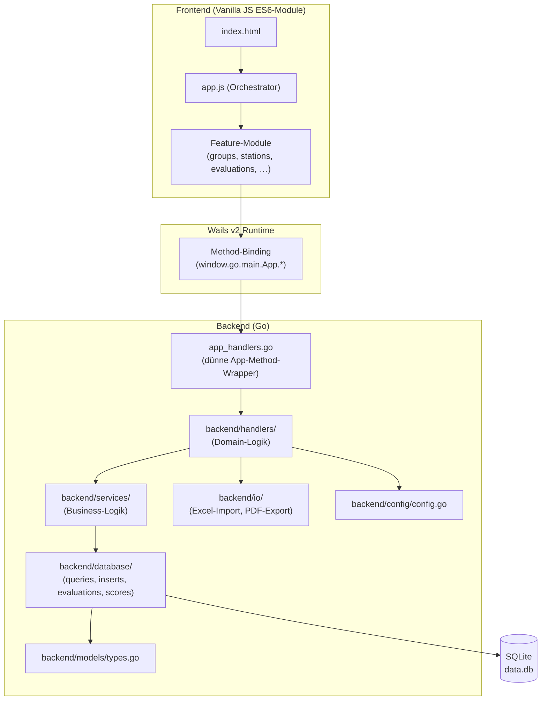

# Architektur

## Überblick

Jugendolympiade Verwaltung ist eine **Wails v2**-Desktop-Anwendung. Go läuft als Backend, ein Vanilla-JS-Frontend rendert die UI über eine eingebettete WebView.



## Schicht-Verantwortlichkeiten

| Schicht | Paket | Verantwortung |
|---------|-------|---------------|
| Einstiegspunkt | `main.go` | App-Struct, Start-/Stop-Hooks, Wails-Bootstrap |
| Dünne Wrapper | `app_handlers.go` | Delegiert `App`-Methoden an `backend/handlers/` |
| Domain-Handler | `backend/handlers/` | Kombiniert Services + DB + IO, kein Wails-Import |
| Business-Logik | `backend/services/` | Gruppenverteilungs-Algorithmus |
| Datenzugriff | `backend/database/` | SQL-Queries, Inserts, Auswertungen |
| Datei-I/O | `backend/io/` | Excel-Import, PDF-Generierung, Master-Excel-Konvertierung (`convert.go`) |
| Modelle | `backend/models/` | Gemeinsame Datenstrukturen |
| Konfiguration | `backend/config/` | TOML-Parsing, Validierung |

## Frontend ↔ Backend Kommunikation

Die Wails-Runtime bindet alle exportierten Methoden des `App`-Structs automatisch ans JavaScript:

```javascript
// Frontend-Aufruf
const result = await window.go.main.App.LoadFile();
```

```go
// app_handlers.go — dünner Wrapper
func (a *App) LoadFile() map[string]interface{} {
    return handlers.LoadFile(a.ctx, &a.db)
}

// backend/handlers/files.go — eigentliche Logik
func LoadFile(ctx context.Context, db **sql.DB) map[string]interface{} { ... }
```

Die Wails-spezifischen Teile sind auf `app_handlers.go` beschränkt — die gesamte Domain-Logik ist unabhängig testbar.

## Frontend-Modulstruktur

```
frontend/
├── index.html              Hauptlayout
├── app.js                  Orchestrator — importiert Module, exponiert ans window
├── shared/
│   ├── dom.js              DOM-Refs, setStatus(), clearAllTabs()
│   └── utils.js            escapeHtml(), switchTab()
├── admin/
│   ├── file-handler.js     Datei-laden, Backup, Restore, Gruppenverteilung, Master-Excel-Konvertierung
│   ├── config-editor.js    In-App TOML-Konfigurations-Editor
│   ├── name-editor.js      Zweistufiger Dialog zur Namenskorrektur (OV-Auswahl → Inline-Editing)
│   └── cert-layout-editor.js  Zertifikat-Layout-Editor
├── groups/
│   └── groups.js           Gruppen-Anzeige mit Tabs + Statistik
├── stations/
│   ├── stations.js         Ergebniseingabe, Dirty-Tracking, Matrix
│   └── scores.js           Einzelstation-Hilfsklassen
├── evaluations/
│   └── evaluations.js      Gruppen- + OV-Rankings
└── reports/
    └── pdf-handlers.js     PDF-Generierungs-Wrapper
```

**Abhängigkeitsfluss:** Core (`dom`, `utils`) → Feature-Module → `app.js`-Orchestrator.

Funktionen werden via `window.*` für `onclick`-Handler exponiert. Kein Bundler nötig — nativer ES6-Modulsupport des Browsers.

## Wichtige Design-Entscheidungen

### App-scoped Datenbankverbindung

`a.db` ist ein Feld des `App`-Structs. Das eliminiert Concurrency-Probleme bei globalen Variablen und macht die Verbindung einfach testbar und injizierbar.

### Rename-to-Backup-Muster beim Datei-Laden

Beim Laden einer neuen Excel-Datei wird die bestehende Datenbank *umbenannt* (nicht gelöscht), bevor die neue Datenbank initialisiert wird. Bei einem Initialisierungsfehler wird das Backup automatisch wiederhergestellt.

### Transaktionen für Massen-Inserts

Alle Mehrfach-Inserts (Gruppen, Scores, Teilnehmende) werden in einer einzigen Transaktion ausgeführt. Eine fehlgeschlagene Zeile rollt die gesamte Operation zurück.

### Fremdschlüssel-Enforcement

`PRAGMA foreign_keys = ON` wird bei jeder neuen Datenbankverbindung gesetzt — SQLite deaktiviert FKs standardmäßig.
