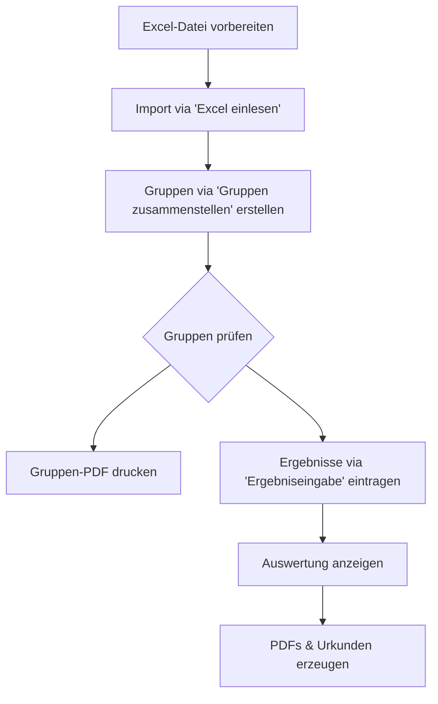

# Schnellstart

## Download

Aktuelle Version von der GitHub-Releases-Seite herunterladen:

| Plattform | Datei |
|-----------|-------|
| Windows | `THW-JugendOlympiade.exe` |

## Systemvoraussetzungen

- Windows 10 oder neuer
- [WebView2 Runtime](https://developer.microsoft.com/microsoft-edge/webview2/) (in Windows 11 enthalten; für Windows 10 separat herunterladen)

## Erster Start

1. Doppelklick auf die ausführbare Datei.
2. Falls eine bestehende Datenbank (`data.db`) vorhanden ist, erscheint ein Dialog:
    - **„Weiterarbeiten"** — öffnet die vorhandene Datenbank.
    - **„Neu starten"** — sichert die alte Datenbank und beginnt neu.

!!! info "📸 Screenshot: `startup-dialog.png`"
    _Startdialog — „Weiterarbeiten" oder „Neu starten"_

3. Das Anwendungsfenster öffnet sich. Der Ausgabeordner (`pdfdocs/`) und Beispieldaten werden automatisch angelegt.

## Vollständiger Ablauf

!!! info "📸 Screenshot: `main-window.png`"
    _Hauptfenster der Anwendung nach dem Start_

### Schritt 1 — Excel-Datei vorbereiten

Siehe [Excel-Import](user-guide/excel-import.md) für die erforderliche Tabellenstruktur.

### Schritt 2 — Daten importieren

1. **📝 Daten → „Excel einlesen"** klicken.
2. XLSX-Datei im Dialog auswählen.
3. Grüne Statusmeldung bestätigt den Erfolg.

### Schritt 3 — Gruppen erstellen

**„Gruppen zusammenstellen"** klicken. Sind Fahrzeuge importiert, läuft der **Fahrzeug-zuerst-Algorithmus**: jede Gruppe erhält genau ein Fahrzeug, Betreuende werden danach zugeteilt und das Betreuenden:TN-Verhältnis wird automatisch ausgeglichen. Ohne Fahrzeuge verteilt der klassische Algorithmus nach `max_groesse`.

Siehe [Gruppenverteilung](user-guide/groups.md) für eine vollständige Beschreibung des Algorithmus.

!!! warning "Ergebnis-Sperre"
    Sobald das erste Ergebnis gespeichert wurde, ist **„Gruppen zusammenstellen"** gesperrt. Gruppen vor der Ergebniseingabe konfigurieren.

### Schritt 4 — Ergebnisse erfassen

**„Ergebniseingabe"** öffnet die Eingabematrix. Beliebige Zelle anklicken, um direkt zur Eingabe der jeweiligen Gruppe/Station zu springen.

### Schritt 5 — Auswerten & exportieren

Aus **📊 Ausgabe** erzeugen:

- **Gruppen-PDF** — Teilnehmerlisten je Gruppe
- **Gruppenwertung-PDF** — Gruppen-Rankings
- **Ortsverwertung-PDF** — Ortsverband-Rankings
- **Urkunden Teilnehmende** — individuelle Urkunden
- **Urkunden OV** — Ortsverband-Urkunden (Sieger erhält Siegerurkunde)
