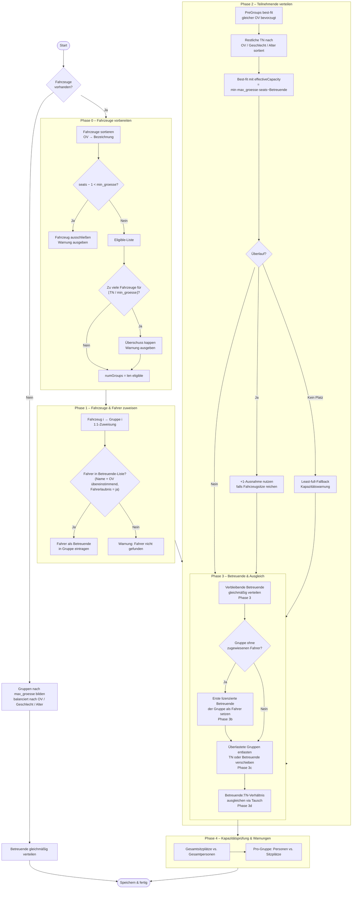

# Gruppenverteilung

Nach erfolgreichem Excel-Import **„Gruppen zusammenstellen"** klicken.

## Verteilungsalgorithmus

Das Verhalten unterscheidet sich je nachdem, ob Fahrzeuge importiert wurden.

---

### Ohne Fahrzeuge (klassischer Pfad)

1. **Pre-Groups werden zuerst platziert** — Teilnehmende mit demselben `PreGroup`-Code kommen in eine dedizierte Gruppe.
2. **Gruppenanzahl** = `anzahlPreGroups + ceil(übrigenTeilnehmende / max_groesse)`.
3. **Restliche Teilnehmende** werden per Diversity-Score verteilt:

    | Faktor | Gewicht |
    |--------|---------|
    | Gleicher Ortsverband bereits in Gruppe | ×2,0 Malus |
    | Gleiches Geschlecht bereits in Gruppe | ×1,5 Malus |
    | Alter nah am Gruppenaltersdurchschnitt | +1,0 Malus |
    | Gruppengröße | +0,5 je Mitglied |

    Jede Person kommt in die Gruppe mit dem **niedrigsten Malus**.

4. **Betreuende** werden anschließend gleichmäßig verteilt (siehe [Betreuende-Verteilung](#betreuende-verteilung-vier-phasen) weiter unten).

---

### Mit Fahrzeugen (Fahrzeug-zuerst-Pfad)

Wenn Fahrzeuge importiert wurden, startet ein mehrstufiger Algorithmus, der sicherstellt, dass jede Gruppe **genau in ihr Fahrzeug passt**.



#### Schlüsselbegriffe

| Begriff | Bedeutung |
|---------|-----------|
| `max_groesse` | Harte Obergrenze für Teilnehmende pro Gruppe |
| `min_groesse` | Untergrenze: Fahrzeuge mit weniger Passagierplätzen werden ausgeschlossen (Standard: 6) |
| `effectiveCapacity` | `min(max_groesse, Sitzplätze − Betreuende-Anzahl)` — tatsächlich verfügbare TN-Plätze |
| +1-Ausnahme | Hat ein Fahrzeug mehr Sitze als `max_groesse`, werden die Extra-Plätze für Überlauf-TN genutzt |
| Phase 3c | Verschiebt TN (oder Betreuende) von übervollen in Gruppen mit Reserveplätzen |
| Phase 3d | Tauscht eine Betreuende ↔ TN zwischen der Gruppe mit dem höchsten und dem niedrigsten Betreuenden:TN-Verhältnis; Gesamtgröße je Gruppe bleibt konstant |

---

### Betreuende-Verteilung (vier Phasen)

Gilt für beide Pfade (klassisch und Fahrzeug-zuerst). Im Fahrzeug-Pfad werden bereits als Fahrer eingetragene Betreuende übersprungen.

1. **Phase 1** — Personen mit Fahrerlaubnis gleichmäßig verteilen: eine Person pro Gruppe in Prioritätsreihenfolge.
2. **Phase 2** — Personen ohne Fahrerlaubnis folgen ihrem Ortsverband: bevorzugt die Gruppe mit einer lizenzierten Person aus demselben OV.
3. **Phase 2b** — Neuausgleich: Personen ohne FL von der größten in die kleinste Gruppe verschieben, bis der Unterschied ≤ 1 ist.
4. **Phase 3 (Sicherheitsnetz)** — Gruppen ohne Betreuende erhalten eine Person aus der größten Gruppe.

### Warnmeldungen

Nach der Verteilung erscheinen Warnungen für:

- Gruppen **ohne jede Betreuungsperson**.
- Gruppen **ohne Person mit Fahrerlaubnis**.
- Fahrzeuge, deren **Fahrer nicht in der Betreuenden-Liste** gefunden wurde.
- Fahrzeuge, die wegen `min_groesse` **ausgeschlossen** wurden.
- Fahrzeuge, die wegen **zu wenig Teilnehmenden** nicht genutzt werden konnten.
- Überschreitung der **Gesamtsitzplatzkapazität**.

Die Verteilung wird trotzdem gespeichert. Durch Anpassen der Excel-Datei und erneuten Import können die Warnungen behoben werden.

---

## Gruppen anzeigen

### Gruppen-Tab

**„Gruppen anzeigen"** öffnet die Tabellen-Ansicht. Jeder Tab zeigt:

- Teilnehmende mit Alter, Geschlecht, Ortsverband
- Betreuende mit Fahrerlaubnis-Status (Fahrer eines Fahrzeugs erscheinen hier ebenfalls)
- Fahrzeuge mit Fahrer, Sitzplätzen und Kapazitätsanzeige; bei fehlender Fahrzeugzuweisung: **„Kein Fahrzeug!"** (roter Hinweis)
- Gruppenstatistik (Anzahl, Geschlechterverteilung, OV-Verteilung)

!!! info "📸 Screenshot: `groups-view.png`"
    _Gruppenansicht — Tabs mit Teilnehmenden, Betreuenden und Fahrzeugen_

### Eingabeübersicht (Ergebnismatrix)

**„Eingabeübersicht"** zeigt eine Matrix aller Gruppen × Stationen. Klick auf eine Zelle springt direkt zur Ergebniseingabe für diese Kombination.

!!! info "📸 Screenshot: `eingabe-uebersicht.png`"
    _Eingabeübersicht — Gruppen × Stationen Matrix mit ✓/✗ Status_

## Gruppengrößen konfigurieren

In `config.toml` anpassen, danach **„Gruppen zusammenstellen"** erneut klicken:

```toml
[gruppen]
max_groesse = 8   # Maximal-TN pro Gruppe
min_groesse = 6   # Minimal-TN pro Gruppe (Fahrzeug-Pfad)
```

## Gruppennamen anpassen

Über `gruppen.gruppennamen` in `config.toml` können benutzerdefinierte Gruppenbezeichnungen vergeben werden (z. B. Gerätegattungen wie „Hebekissen", „Steckleiter", …). Die Namen erscheinen in der Gruppen-Ansicht, der Ergebniseingabe, der Auswertung und auf Teilnehmer-Urkunden.

```toml
[gruppen]
gruppennamen = ["Hebekissen", "Rüstholz", "Tauchpumpe"]
```

Sind weniger Namen als Gruppen vorhanden, wird für fehlende Einträge automatisch **„Gruppe N"** verwendet.

!!! warning
    Neuverteilung ist nur möglich, **bevor das erste Ergebnis gespeichert wurde**. Danach ist die Schaltfläche gesperrt.

## Gruppen-PDF erzeugen

**📊 Ausgabe → „Gruppen-PDF erstellen"** erzeugt ein mehrseitiges PDF (eine Seite je Gruppe) mit allen Teilnehmenden, Betreuenden und dem zugewiesenen Fahrzeug. Datei wird in `pdf_ordner` gespeichert.
